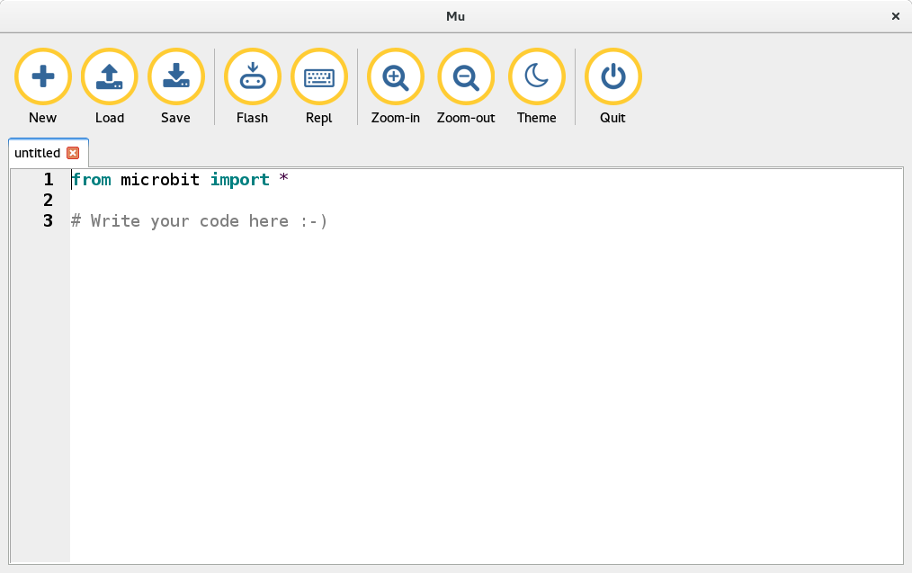
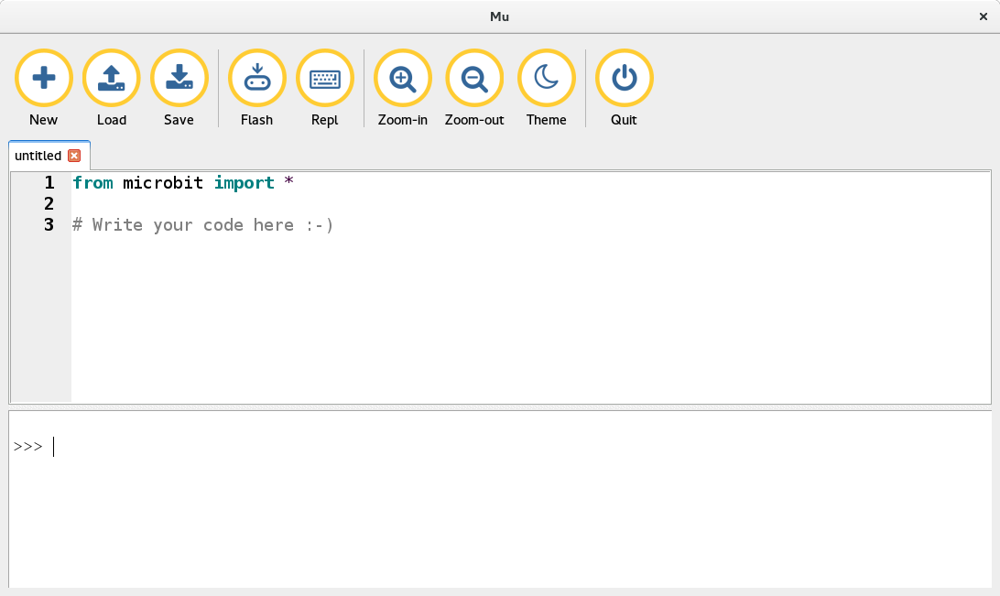
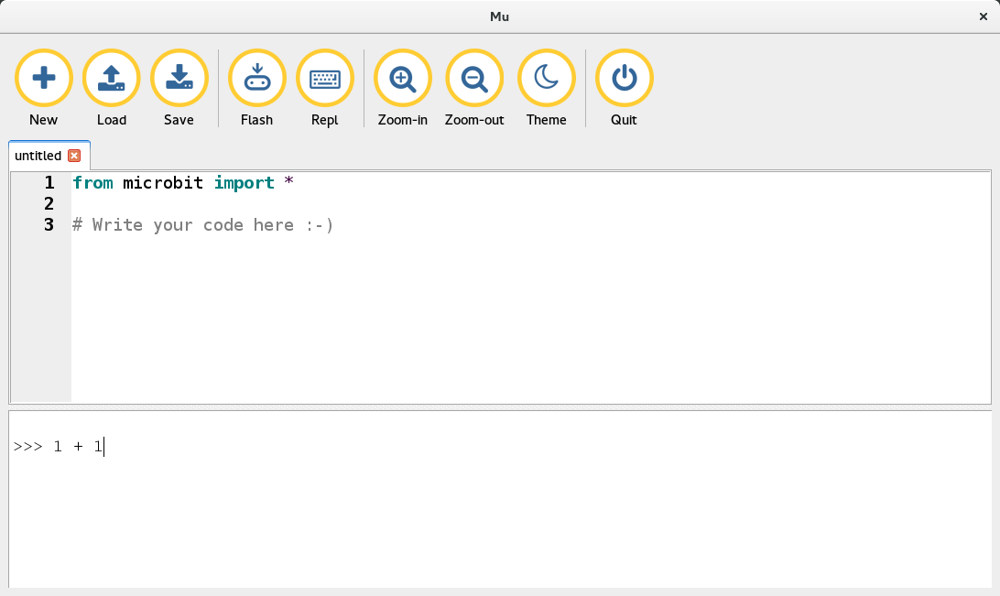
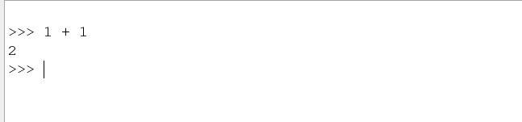

First steps with your micro:bit
===============================

Your micro:bit is a tiny computer. It understands a language called Python. It will do only what
you ask it do.

Let us start with very simple adding. What is the answer of 1 + 1. Do you know it? We will now
see how to ask the same to your micro:bit.

Open mu first
-------------

When you start ``mu`` it looks like the about picture. Now connect your micro:bit to your computer
and press the ``Repl`` button. It may ask you to press the `reset` button in the back of your micro:bit
for few seconds and try again.

Then you may see something like below

Can you see those `>>>` and the cursor blinking after that? That is called
`Repl`. We will talk to our micro:bit using that place. Do you remember our
question? What is the answer for 1 + 1? Let us write that in the repl.

Keep in mind that we have one space before and one space after the + sign.
After you type `1 + 1` press the `Enter` key in your keyboard. The micro:bit
will calculate, and tell you the answer.

.. note:: Computers are very much sensitive about how you talk to them.
   If you give any extra space (blank space by using the spacebar in keyboard) it may
   not like it. Like, in the following I am giving one extra space in the beginning
   of the line.
   ::

        >>>  1 + 1
        Traceback (most recent call last):
          File "<stdin>", line 1
        IndentationError: unexpected indent 

   When ever you see `IndentationError`, remember to check for any extra spaces in your code.

Now you try to find the answer of something else. Like what is the answer of
`110 + 220`. Can you ask your micro:bit what is the answer?
::

    >>> 110 + 220
    330

Mathematical operators
-----------------------

This `+` sign which we used is known as addition operator. We have many other mathematical
operators. Like `-` for subtraction, `*` for multiplication, `/` for division.

Let us learn these one by one.

Subtraction or minus
--------------------

Just in the way we added 1 and 1, we can do subtraction. What is the answer for
`7 -3`. Let us just ask that to our micro:bit.
::

    >>> 7 - 3
    4

Now something bigger
::

    >>> 34 - 21
    13

